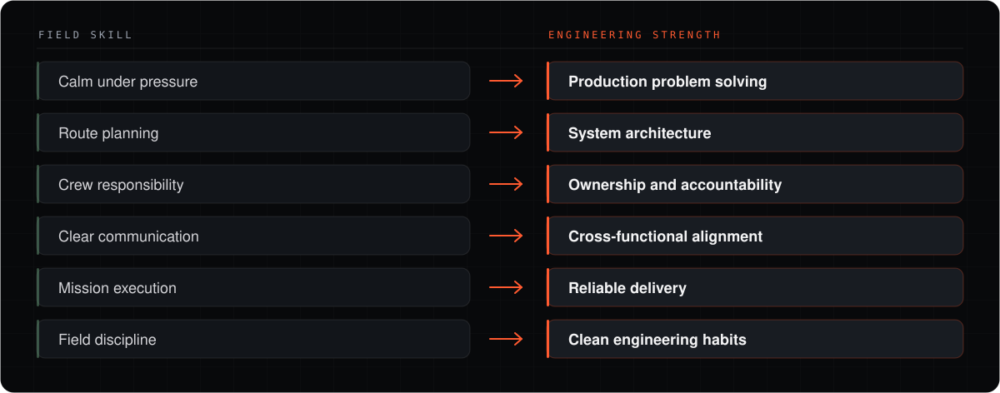

<div align="center">


<br>

<a href="https://matthew-tsiplakov.vercel.app/"></a>
<a href="https://matthew-tsiplakov.vercel.app/projects"></a>
<a href="https://matthew-tsiplakov.vercel.app/lab"></a>
<a href="https://matthew-tsiplakov.vercel.app/resume"></a>
<a href="https://www.linkedin.com/in/matthew-tsiplakov"></a>
<a href="mailto:mati.tsiplakov@gmail.com"></a>

</div>

---

### Intro

Software developer building full-stack systems, clean interfaces, and practical architecture.
I bring field-tested ownership, calm execution, and route-planning discipline into software work.

---

### Field Skills → Engineering Strengths



---

### Tech Stack

**Languages**


**Web & Frameworks**


**Backend & Data**


**Cloud & DevOps**


---

### Featured Projects

<table>
<tr>
<td width="33%" valign="top">

#### [SupChat](https://github.com/Drakomt/SupChat)

Real-time chat for private and group conversations, backed by Node.js and Socket.io.

<sub>`React` `TypeScript` `Node.js` `MongoDB` `Socket.io`</sub>

</td>
<td width="33%" valign="top">

#### [Lord of the Pings](https://github.com/Drakomt/Lord-of-the-Pings)

Socket-based client-server networking, built around TCP/IP and packet analysis.

<sub>`Python` `TCP/IP` `Sockets` `Wireshark` `Kivy`</sub>

</td>
<td width="33%" valign="top">

#### [Dog vs Cat ML](https://github.com/Drakomt/Dog_vs_Cat_ML)

Image classification in Python — training pipeline, saved models, and a prediction GUI.

<sub>`Python` `Jupyter` `Machine Learning` `Model Training` `Data Processing`</sub>

</td>
</tr>
</table>

**More builds** — [NetflixClone](https://github.com/Drakomt/NetflixClone) · [EshopMERN](https://github.com/Drakomt/EshopMERN) · [DodgeGame](https://github.com/Drakomt/DodgeGame) · [all projects →](https://matthew-tsiplakov.vercel.app/projects)

---

### Current Route

```console
> route --status

  ROLE     Software Developer · 123 Completed LTD
  FOCUS    AI-oriented software project
  STACK    React · Redux · TypeScript · Python · MongoDB · Redis · Kafka · Docker · AWS
  STUDY    B.Sc. Computer Science — in progress
  BASE     Israel
  STATUS   ● open to software roles
```

<sub>Live contribution graph and repository activity render natively below this README on the <a href="https://github.com/Drakomt">profile page</a>.</sub>

---

<div align="center">

**[Portfolio](https://matthew-tsiplakov.vercel.app/)** · **[Projects](https://matthew-tsiplakov.vercel.app/projects)** · **[Lab](https://matthew-tsiplakov.vercel.app/lab)** · **[Resume](https://matthew-tsiplakov.vercel.app/resume)** · **[LinkedIn](https://www.linkedin.com/in/matthew-tsiplakov)** · **[Email](mailto:mati.tsiplakov@gmail.com)**

<sub>Field route → software systems.</sub>

</div>
