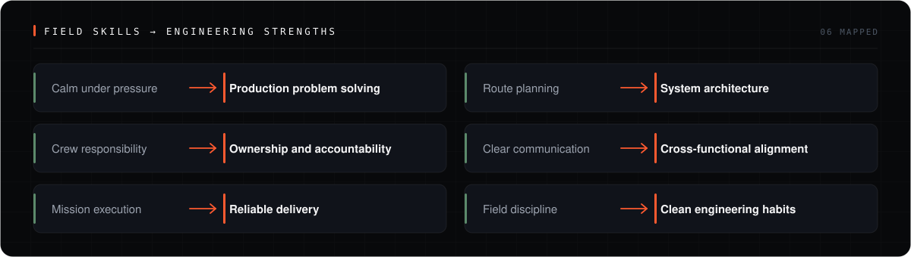
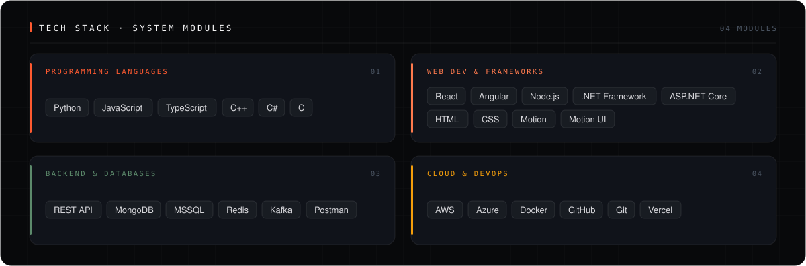
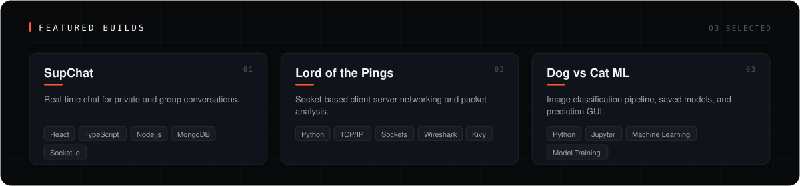

**[SupChat](https://github.com/Drakomt/SupChat)** · **[Lord of the Pings](https://github.com/Drakomt/Lord-of-the-Pings)** · **[Dog vs Cat ML](https://github.com/Drakomt/Dog_vs_Cat_ML)** · [View all projects →](https://matthew-tsiplakov.vercel.app/projects)

<picture>
  <source media="(prefers-color-scheme: dark)" srcset="https://raw.githubusercontent.com/Drakomt/Drakomt/main/dist/github-snake-dark.svg">
  <source media="(prefers-color-scheme: light)" srcset="https://raw.githubusercontent.com/Drakomt/Drakomt/main/dist/github-snake.svg">
  
</picture>

**[Portfolio](https://matthew-tsiplakov.vercel.app/)** · **[Projects](https://matthew-tsiplakov.vercel.app/projects)** · **[Lab](https://matthew-tsiplakov.vercel.app/lab)** · **[Resume](https://matthew-tsiplakov.vercel.app/resume)** · **[LinkedIn](https://www.linkedin.com/in/matthew-tsiplakov)** · **[Email](mailto:mati.tsiplakov@gmail.com)**

Field route → software systems.

